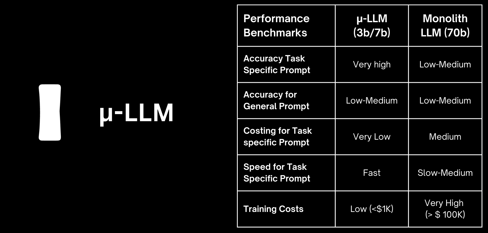
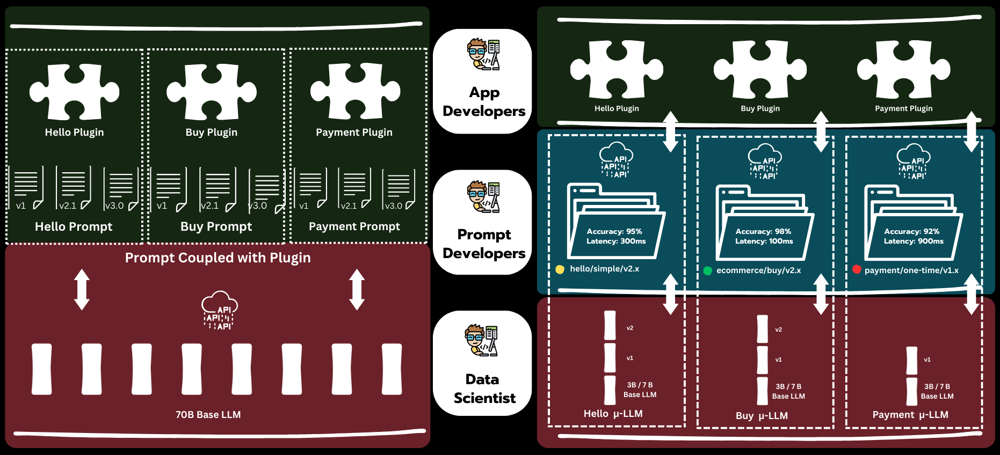

  

# Sugarcane AI: Microservices Framework for LLM Agnostic App Development 🤖

1. [Introduction](#introduction)
2. [Key Features of Microservices Framework](#key-features)
3. [Key Components of the Microservices Framework](#key-components)
    - [1. Micro LLMs 🧬](#micro-llms)
    - [2. Prompt Packages 📦](#prompt-packages)
    - [3. Prompt Templates 📑](#prompt-templates)
4. [Why Microservices Architecture?](#microservices-architecture)
5. [Getting Started](#getting-started)
6. [Demo Videos](#demo-videos)
7. [Contribute](#contribute)
8. [Connect with Us](#connect-with-us)
9. [Book an Appointment](#book-an-appointment)
10. [Roadmap](#roadmap)
11. [License](#license)
12. [Acknowledgments](#acknowledgments)

## Introduction 🙏 

Sugarcane AI is an open-source framework designed to simplify and accelerate LLM app development. With a focus on fine-tuned Language Models (LLMs), prompt management, and Workflow Plugins, Sugarcane AI empowers developers to build, train, and manage complex LLM applications effortlessly. 🎉

## Why Sugarcane AI? : Key Features of Microservices Framework 🚀 

- **Simplify Workflow Development**: Develop, train, and manage workflow plugins seamlessly, reducing complexity over the chain of prompts. 💪

- **Reusable Prompt Packages**: Create, share, and reuse high-accuracy prompts with ease, saving time and effort, and facilitating rapid experimentation in production without regression, ensuring performance visibility at every step.

- **Open Source Community**: Collaborate and contribute to the thriving open-source community of developers dedicated to simplifying AI app development using Sugarcane AI. 🌐

## Key Components of the Microservices Framework 🧩 

### 1. Micro LLMs 🧬 

Micro LLMs, or Micro Language Models, are the heart of Sugarcane AI's microservices architecture. These lightweight, fine-tuned language models provide remarkable accuracy, cost-efficiency, and speed for app development scenarios. They outperform traditional base LLMs and empower developers to achieve superior results with less computational overhead.

### 2. Prompt Packages 📦 

Prompt Packages in Sugarcane AI enable the creation, sharing, and reuse of high-accuracy prompts. These packages simplify the development process by streamlining prompt management. They enhance personalization, reduce response times, eliminate errors, and preserve a competitive advantage in AI app development.

### 3. Prompt Templates 📑 

Craft highly effective prompts with ease using Prompt Templates in Sugarcane AI. These templates provide a structured and customizable way to create prompts tailored to your specific AI application needs. Streamline the prompt generation process and ensure consistency across your prompts.

## Why Microservices Architecture? 🏗️ 

Sugarcane AI’s microservices architecture for LLM applications offers a game-changing approach to AI app development, bringing flexibility, scalability, reliability, and efficiency compared to monolithic LLM application structures.

### Focused Development 🤝
Microservices allow developers to concentrate on specific AI application components, ensuring clean and modular code. Each service has a clear task, simplifying development and scalability.

### Boosted Collaboration 🤝
Microservices foster collaboration among development teams. Separate teams can work on different services concurrently, accelerating development and innovation for top-notch AI apps.

### Decoupled Flexibility 🔄
In microservices, prompts, data, and the application layer are decoupled, providing flexibility. Developers can fine-tune LLMs, manage prompts, and handle data independently, enabling rapid experimentation and innovation.

### Robust Reliability, Scalability, and Maintenance 📈
Microservices offer improved reliability, effortless scalability, and streamlined maintenance, ensuring consistent AI app performance without disruptions, regardless of app size, while allowing efficient updates and bug fixes.

Experience the benefits of clean code, rapid iterations, and improved teamwork—supercharge your AI projects today! 🚀

## 🚀 Getting Started 

Explore our [Documentation](documentation_link) for detailed instructions on getting started with Sugarcane AI. Dive into our Quick Start guide to build your first AI app in no time!

## 📺 Demo Videos 

Watch our demo videos on [https://sugarcaneai.dev/demo/](https://sugarcaneai.dev/demo/) for examples of how Sugarcane AI's solutions can supercharge your AI app development.

### Demo - Prompt Packages 🤖

## 🤖 Contribute 

Join our growing community of developers and contributors. Contribute to Sugarcane AI, report issues, or submit feature requests on our [GitHub Repository](github_link).

Contribute to Sugarcane AI with the following steps:

1. Fork this repository.
2. Create a new branch for your contributions.
3. Implement your changes and commit them with clear messages.
4. Push your changes to your forked repository.
5. Open a pull request, and we'll review your contributions.

## 🌐 Connect with Us 

Stay updated with the latest news, discussions, and support on our communities.

- 🌐 [LinkedIn](https://www.linkedin.com/company/sugarcane-ai/)
- 🐦 [Twitter](https://twitter.com/sugarcaneai)
- 💬 [Discord](https://discord.com/invite/WRu3KXqz)

## 📅 Book an Appointment 

Have questions, need assistance, personalized support, or just want to share your thoughts on our product? Book an appointment with our team on Calendly [here](https://calendly.com/hi--qja).

## Roadmap 🗺️ 

Our roadmap for Sugarcane AI is structured around three critical layers within the LLM ecosystem, each designed to empower data scientists and prompt & application developers:

### 1. Prompt Layer 📑

In this phase, we're doubling down on the Prompt Layer. Our mission is to equip you with robust tools for efficient dataset management, prompt control, and Micro LLM training. Expect precise and high-accuracy prompts at your fingertips.

### 2. Workflow Layer 🚀

Next, we're turning our focus to the Workflow Layer. Brace yourself for a user-friendly UI toolkit that simplifies workflow design, deployment, and integration. We're making it effortless to build workflows into web, mobile, and chat applications.

### 3. Marketplace Layer 🌐

The Marketplace Layer is where the magic happens. We're enhancing this core component to allow you to package, share, and reuse workflows, prompts, and datasets effortlessly across the developer ecosystem, fostering collaboration and innovation across the community.

Join us on this exhilarating journey as we transform Sugarcane AI into a powerful and user-friendly platform for Micro LLM-driven workflow automation solutions tailored to developers like you.

## License 📄 

Sugarcane AI is licensed under the MIT License - see the [LICENSE](LICENSE) file for details.

## Acknowledgments 🙏 

We appreciate the contributions from our dedicated community members. You make Sugarcane AI shine! ✨

---
Join Sugarcane AI in simplifying AI app development. Let's make AI accessible to everyone! 🌐 🚀
